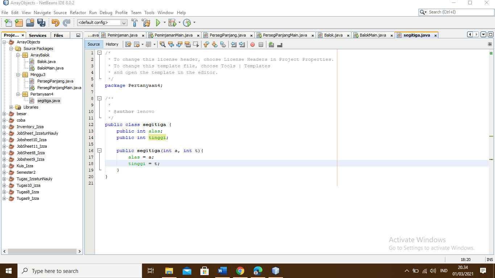
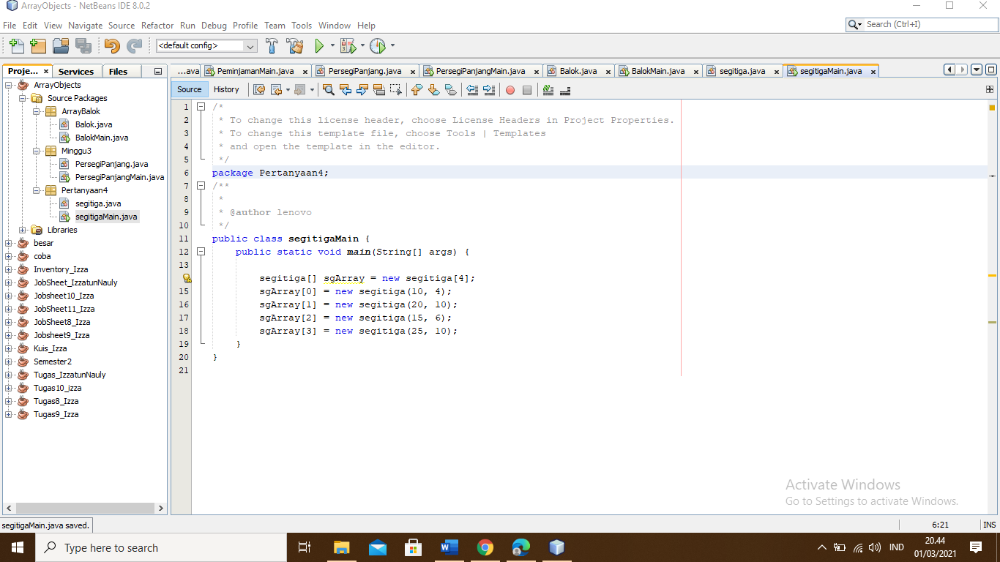
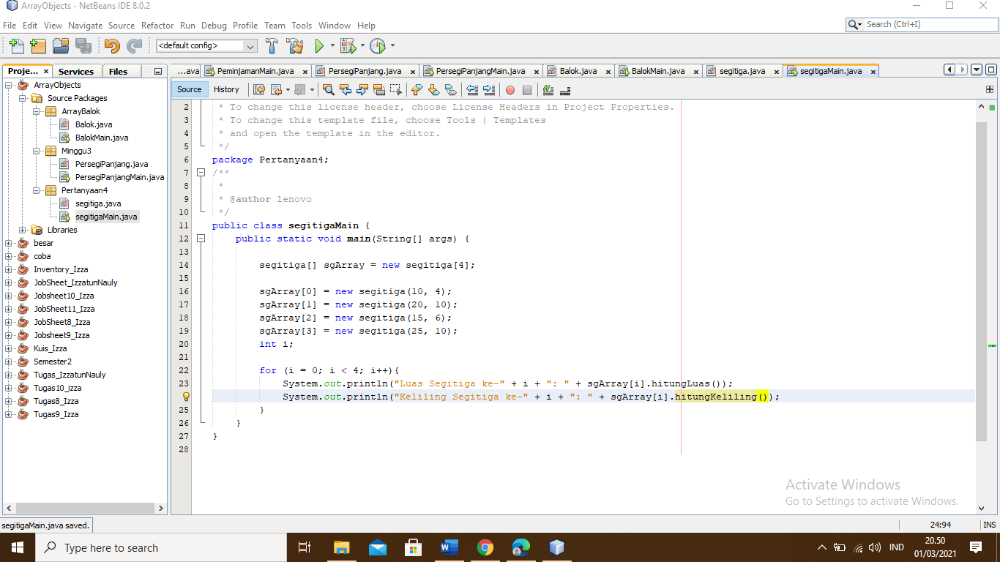
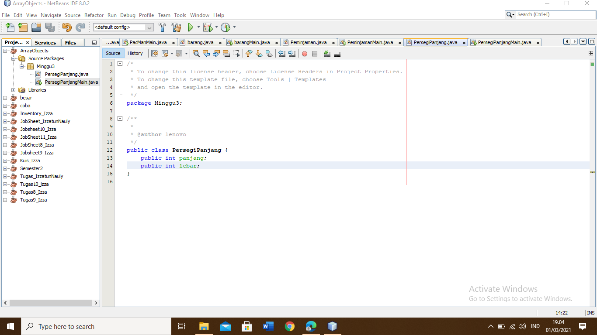
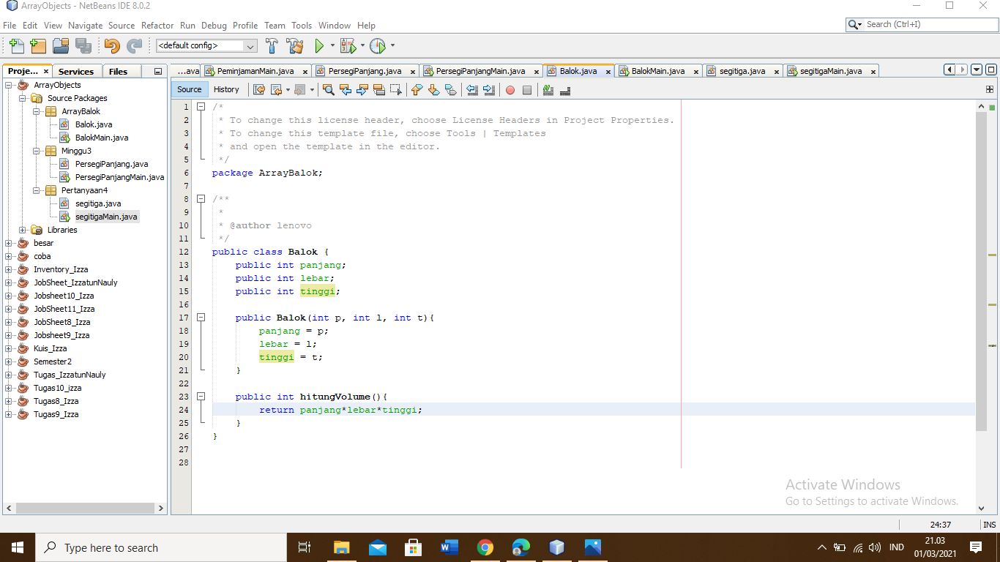

# Pertanyaan 3.2.3
## jawaban
### 1.	Iya, karena class berisi kumpulan attribute dan method dalam suatu unit untuk suatu tujuan tertentu jika tidak ada attribute dan method maka class tersebut tidak akan ada isinya
### 2.	Tidak memiliki konstruktor, dilakukan pemanggilan dengan cara class itu sendiri
### 3.	Pernyataan di atas akan membuat array yang dapat memegang referensi dari 3 objek dari class PersegiPanjang. Namun, pernyataan ini tidak membuat objek dari class itu sendiri. Objek-objek ini harus dibuat secara terpisah menggunakan konstruktor dari class PersegiPanjang.
### 4.	Memasukkan data pada array ke 0 dengan langkah pertama instansiasi lalu memasukkan data pada panjang dan lebar
### 5.	Agar lebih spesifik atau terperinci

# Pertanyaan 3.3.3
## jawaban
### 1.	Bisa
### 2.	Jika dibuat dua dimensi maka seperti tabel, ada yang menjadi baris dan ada yang menjadi kolom seperti contoh
### String[][]huruf = { {"A","B","C"}, {"D","E","F"}, {"G","H","I"}, };
### If (i = 0; i < 3; i++){
#### If (j = 0; j[0].length; j++){
	}
}
### 3.	Kurang instansiasi objeknya
### 4

### 5.	Boleh, asalkan kita instansiasi objek lalu memasukkan datanya seperti contoh
### ppArray[0] = new PersegiPanjang();
### ppArray[0].panjang = 12;
### ppArray[0].lebar =4;

# pertanyaan 3.4.4
## jawab
### 1.	Konstruktor bisa lebih dari satu contoh
### Public class user {
### Public String usename;
### Public String password;
### }

### Public user (String name, String pass){
### Username = name;

### 2.

### 3.

### 4.

### 5.

# Gambar yang tekait:

