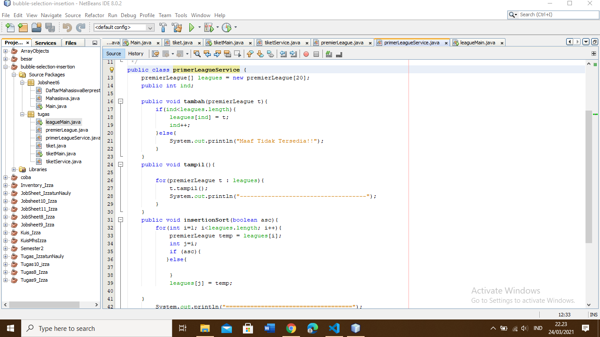

# Pertanyaan 5.2.3
## 1.	Pada method bubble sort di class Daftar Mahasiswa Berprestasi
## 2.	Tidak ada di methot manapun atau class manapun
## 3.	Swap adalah pertukaran yang terdapat pada pada class Daftar Mahasiswa Berprestasi pada kode:
### Mahasiswa tmp = listMhs[j];
### listMhs[j]=listMhs[j-1];
### listMhs[j-1] = tmp;
## 4.	Untuk pengurutan pada proses buble sort  atau proses swap pada bubble sort untuk pengurutan dari yang terkecil ke terbesr
## 5.	A. Pada penggunaan perulangan i untuk data data mahasiswa sedangkan perulangan j untuk proses pengecekan atau pengurutan pada bubble sort
## B. karena untuk i<listMhs.length-1 itu dari banyaknya data dari listMhs dikurangi 1 atau dilakukan sebanyak listMhs.length-1
### C. untuk j<listMhs.length-i itu dimana nanti perulangan akan dilakukan dari data ke-I maka pertukarannya sebanyak .length-i atau dilakukan pengecekan sebanyak data ke I dan akan dilanjutkan ke proses bubble sortnya
## D. maka akan 50 kali perulangan i berlangsung dan ada 50 tahapan bubble sort
# Pertanyaan 5.3.3
## 1.	Perulangan dari J sama dengan i ditambah 1 dan j kurang dari listMhs dan jika listMhs j pada ipk kurang dari listMhs idxMin pada ipk maka idxMin sama dengan nilai j
# gambar yang tekait untuk parktik

# gambar terkain untuk tugas

